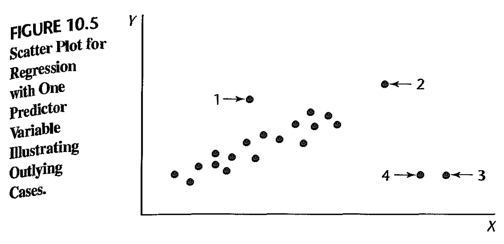

```{r, include=FALSE, echo=FALSE}
knitr::opts_chunk$set(
	error = FALSE,
	message = FALSE,
	warning = FALSE,
	options(knitr.kable.NA = ''),
	fig.width=5, fig.height=4,#set figure size
	fig.align='center',#center plot
	tidy = FALSE
)
```

*Reference: textbook sec. 10.2, 10.3, 10.4; lecture summary 26.*

# Outlying cases

```{r, echo=FALSE,out.width="60%"}

```

- Outlying Y observations: case 1, 3, 4.
- Outlying X observations: case 2, 3, 4.
- **Influential cases**: case 3, 4. They are outlying with regard to their X values, and their Y values are not consistent with the regression relation for the other cases.

# Diagnostics of outliers

**Simple linear regression**: box plots, stem-and-Ieaf plots, scatter plots, and residual plots.

**Multiple linear regression**: Recall the least square estimates is $\hat{\beta}=(X'X)^{-1}X'Y$, and fitted value is $\hat{Y}=X\hat{\beta}=X(X'X)^{-1}X'Y$. Define the hat matrix as $H=X(X'X)^{-1}X'$, then $\hat{Y}=HY$. 

The residulas can be expressed as $\hat{\epsilon}=(I-H)Y$, hence the variance of residual $\hat{\epsilon}_i$ is $\sigma^2(1-h_{ii})$, where $h_{ii}$ is the $i$th element on the main diagonal of the hat matrix. Using MSE as the estimator of the error variance $\sigma^2$, we get the standard error of $\hat{\epsilon}_i$ as 
$s.e.(\hat{\epsilon}_i)=\sqrt{MSE(1-h_{ii})}$.

- Identifying outlying Y observations:

    - studendized residual:
$r_i=\frac{\hat{\epsilon}_i}{s.e.(\hat{\epsilon}_i)}=\frac{\hat{\epsilon}_i}{\sqrt{MSE(1-h_{ii})}}.$

    - jackknife (deleted) residual: Fit the regression with the $i$th case deleted; let $Y_{i(-i)}$ denote the predicted value for $Y_i$, under this regression. $d_i = Y_i - Y_{i(-i)}$ is called the deleted residual.
    
    - studentized deleted residual: 
    $t_i=\frac{d_i}{s.e.(d_i)}$, where $s.e.(d_i)=\frac{MSE_{(i)}}{1-h_{ii}}$. Under the null hypothesis that there are no outliers, $t_i \sim t_{n-p-1}$. 
    
    - Test for outliers by Bonferroni method: Reject $H_0$ (no outlying Y observations), if $\max_{1\leq i\leq n} |t_i|> t_{n-p-1}(1 -\frac{\alpha}{2n})$.
 
- Identifying outlying X observations:
    
    - leverages: $h_{ii}$, which is a measure of the distance between
    the $X$ values for the $i$ th case and the means of the $X$ values for all $n$ cases. If $h_{ii}> 2p/n$, case $i$ is considered outlying in $X$.
  
- Identifying influential cases:
    
    - Cook's distance: $D_i=\frac{(\hat{Y} - \hat{Y}_{(i)})'(\hat{Y} - \hat{Y}_{(i)})}{pMSE}=\frac{\epsilon_i^2}{pMSE}\frac{h_{ii}}{(1-h_{ii})^2}$. Case $i$ is considered as influential case if $D_i>4/n$.

# Example: Can you find outliers and influential cases for model below?

```{r}
fit=lm(Sepal.Length~ ., data=iris)
fit
plot(fit,which=1:6)
```

